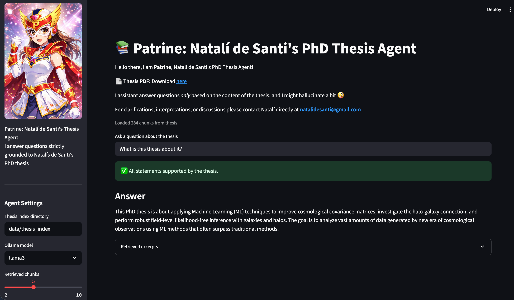

# 📚 Patrine: Natalí de Santi's PhD Thesis Agent

This repo keeps **Patrine**, my PhD Thesis Agent

It is a **local, thesis-specific question–answering agent** built with `Streamlit` and `Ollama`.  
Patrine answers questions **strictly based on the contents of the PhD thesis**, without using external knowledge, but might hallucinate.

---

## Features

- Thesis-only knowledge base
- Semantic retrieval using sentence embeddings
- Answer verification (attempt to hallucination detection)
- Fully local LLM inference via Ollama
- Interactive Streamlit interface

---

## Running the streamlit application

`$ streamlit run thesis_qa_streamlit.py`

---

## Requirements

* `ollama` (download at least `llama3` and `mistral` follow instructions at: https://ollama.com/download)
* `sys`
* `re`
* `json`
* `numpy`
* `Path`
* `pdfminer`
* `sentence_transformers`
* `streamlit`
* `sklearn`